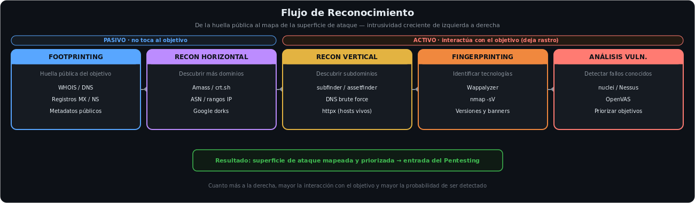

<h1 align="center">Recopilación de Información · OSINT & Recon</h1>

  
  
  
  

---

## Sobre este módulo

Antes de cualquier ataque o auditoría hay que **conocer al objetivo**. El reconocimiento avanza de lo menos intrusivo (fuentes públicas que no tocan al objetivo) a lo más intrusivo (interacción directa que deja rastro), estrechando el foco hasta un listado priorizado de objetivos.

**Temas cubiertos:** footprinting pasivo y activo · reconocimiento horizontal y vertical · fingerprinting · análisis de vulnerabilidades · OSINT sobre personas y organizaciones · mapeo a MITRE ATT&CK (fase Reconnaissance).

---

## Flujo de reconocimiento

De la huella pública al mapa de la superficie de ataque. Cuanto más a la derecha, mayor la interacción con el objetivo y mayor la probabilidad de ser detectado.

---

## Práctica

Informe de inteligencia completo sobre un objetivo real (programa de Bug Bounty), aplicando las cuatro fases:

- **Footprinting** — descubrimiento de subdominios (shuffledns, Amass), correlación por Google Analytics IDs.
- **Fingerprinting** — validación de hosts vivos (httpx), escaneo de puertos (masscan), detección de tecnologías y WAF.
- **Análisis de vulnerabilidades** — nuclei, subdomain takeover, análisis SSL/TLS, DMARC/SPF/DKIM.
- **OSINT** — identificación de empleados y cargos clave con Maltego y Google Dorking.

---

## Stack

`shuffledns` · `Amass` · `httpx` · `masscan` · `nuclei` · `Maltego` · `wafw00f` · `ffuf` · `exiftool`

---

## Módulo relacionado

- **[Pentesting](https://github.com/juanmalbran/pentesting)** — la fase siguiente: la inteligencia recopilada alimenta la explotación.

---

  Parte del portfolio de <a href="https://github.com/juanmalbran">Juan Malbrán · M4LBYTE</a>

